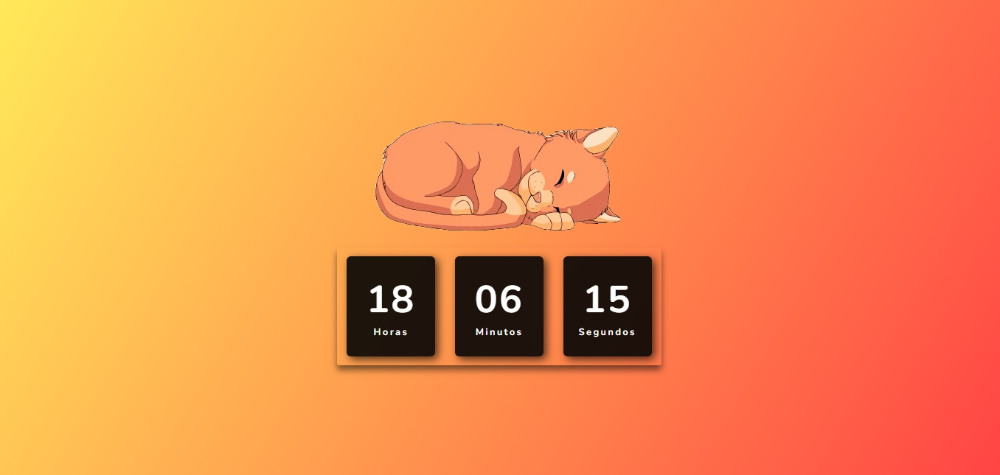

  

<h1>🕰️Relógio Digital</h1>

 
  Trata-se de um projeto de Relógio Digital, aplicando conhecimentos adquiridos em HTML, CSS e Javascript.

 

<h2>💻Tecnologias e ferramentas utilizadas</h2>

   
   
     
          

 

📆 Atualizado em julho, 2024.
 
